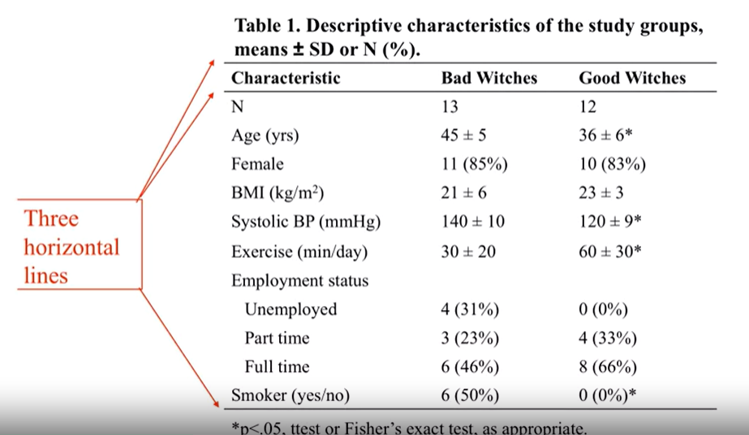
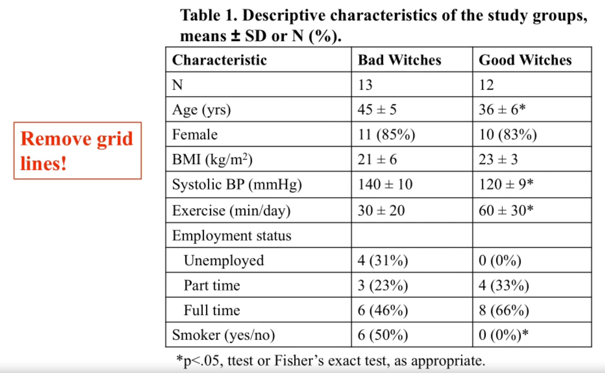
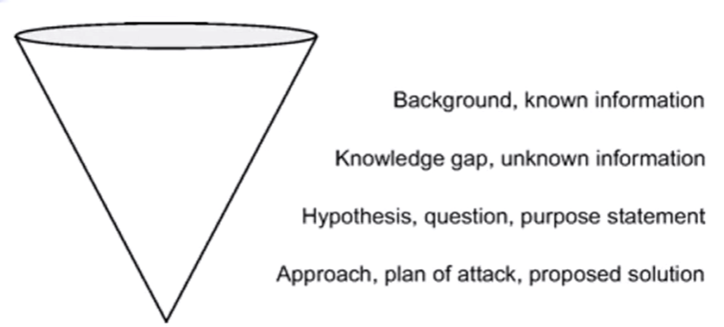
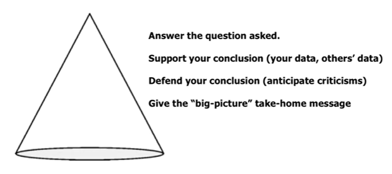
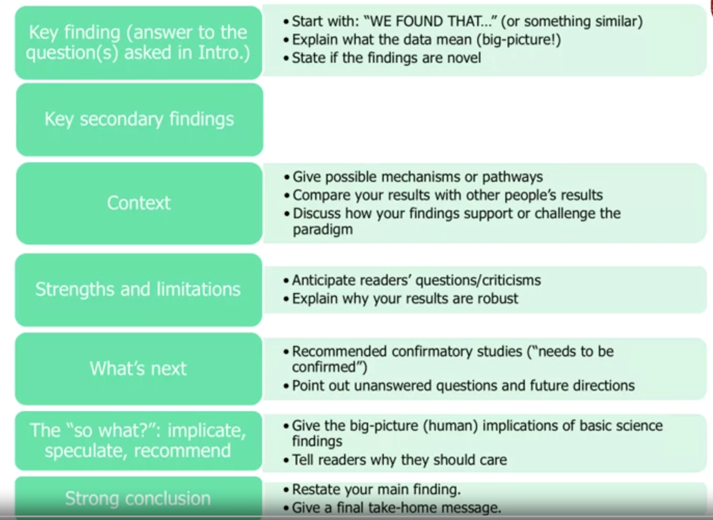

[Coursera - Writing in the Sciences](Coursera%20-%20Writing%20in%20the%20Sciences.md)

# Week 5 - Write manuscript

- Understand how to write the sections of an original scientific manuscript.
- Critique poorly formatted tables and figures.
- Practice writing strong Results and Introduction sections.
- Summarize the elements of a Discussion

- **Recommended order for writing an original manuscript**
	- **Tables and figures**
		- Each of them should have a clear point **=> joint together to tell a story**
		- Make them look professional
	- **Results**
		- Gives a high-level summary of each table and figure
	- **Methods**
		- Could write it anytime
	- **Introduction**
		- Write the Table, Figures and Results before to know how to frame the Introduction
	- **Discussion**
		- Hardest to write
		- Involves the most writing, the most complex 
	- **Abstract**
		- Always write the Abstract last 
		- Abstract is easy to write after finish other sections

## 1. Tables and figures

- Tables and figures are the foundation of your story! 
- Editors, reviewers, and readers may look ***first*** (and maybe only) at titles, abstracts, and tables and figures!
	- Some reviewers skim the abstract just to get a sense of what the paper is about
	- Then jump right to the table and figure.
- Tables and figures should stand alone and tell a complete story. The reader should not need to refer back to the main text.
- Use the ***fewest*** figures and tables needed to tell the story.
- Do not present the same data in both a figure and a table.
- **Figures**:
	- Visual impact
	- Show trends and patterns
	- Tell a quick story
	- Tell the whole story
	- Highlight a particular result
	- Types of figures:
		- Primary evidence
			- gel, photographs, Xray...
			- indicates data quality
			- "Seeing is believing"
		- Graphs
			- line graphs, 
				- Trends over time, age, or dose
				+ Can display group means or individual
			- bar
				- Compare groups at one time point
				- Tell a quick visual story
			- scatter
				- Show relationships between two (or more) variables
				- Allows reader to see individual data points
				- Gives more information!
			- box,...
			- Tips for graphs:
				- Tell a quick visual story
				- Keep it simple
				- Make it easy to distinguish groups
				- If it's too complex, maybe it belongs in a table
		- Drawings and diagrams
			- illustrate an experimental set-up or work-flow
			- Illustrate cause and effect or cycles
			- Give a hypothetical model
			- cartoons
	- Figure legends:
		- allows the figure to stand alone.
		- may contain:
			- brief title
			- essential experimental details
			- definitions of symbols or line/bar patterns
			- explanation of panels
			- statistic: test used, p-val

- **Tables**:
	- Give precise values
	- Display many values/variables
	- **Title**:
		- Identify the specific topic or point of the table
		- Use the same key terms in the table title, the column headings, and the text of the paper
		- Keep it brief!
		- Example: *Descriptive characteristics of the two treatment groups, means+/- SD or N(%)*
	+ **Footnotes:**
		+ Use superscript symbols to identify footnotes (depend on the journal guidelines)
		+ Use footnotes to explain statistically significant differences
		+ Use footnotes to explain experimental details or abbreviations (acronym have to be define within the table)
	- **Format**:
		- Model the tables from already published tables!
		- Follow journal guidelines
		- 3 horizontal lines, align 
		- use a reasonable number of significant figures
		- Give units!
		- Omit the unnecessary columns
		- 
		- UNPROFESSIONAL Tables
		- 

## 2. Results

- Summarize what the data show:
	- point out simple relationships
	- describe big-picture trends
	- cite figures or tables that present supporting data
- Avoid simply repeating the numbers that are already available in tables and figures
- Tips for writing results
	- break into subsections, with headings (it needed)
	- complement the information that is already in tables and figures
		- give precise values that are not available in the figure
		- report the percent change or percent difference if absolute values are given in the table
		- Example: *The good witches do exercise 60 min per day while the bad witches do exercise 30 min per day*
		- --> *The good witches do exercise twice as long as bad witches.*
	- repeat/highlight only the most important numbers
	- don't forget to talk about negative and control results
	- reserve the term **significant** for statistically significant
	- reserve information about what you did for the methods section
		- in particular, do not discuss the rationale for statistical analyses within the results section
	- reserve comments on the meaning of your results for the discussion section
- What verb tense do I use?
	- Use **past tense** for completed actions:
		- We *fount* that...
		- The average reaction time *was*...
		- Women _were_ more likely to...
		+ Men _smoked_ more cigarettes than...
	- Use the **present tense** for assertions that continue to be true
		- *what the tables show, figure shows*
		- *what the data suggest*
		- *the finding confirms*
		- *we believe that*
	- Example:
		- _"Information **was** available for 7799 current cigarette smokers. Of these, 1216 (16%) **were** classified as hardcore smokers. Table 1 **gives** characteristics of all the smokers. The most striking difference **was** that hardcore **were** about 10 years older on average and **tended** to be more dependent on tobacco. Significantly more hardcore smokers **had** manual occupations, **lived** in rented accommodation, and **had completed** their full-time education by the age of 16 years. There **was** no difference by sex."_
- Use the active voice!
	- Move lively!
	- Since you can talk about the subjects of your experiments, "we" can be used sparingly while maintaining the active voice!
	+ Example:
		_"To test whether it was appropriate to exclude a measure of cigarette dependence from our criteria for defining hardcore smoking, **we compared** attitudes and beliefs by dependence in hardcore and other smokers (table 4). For most items, **beliefs were** similar in low and high dependence hardcore smokers but strikingly different from those of other smokers. For example, almost 60% of both low and high-dependency non-hardcore **smokers agreed** that improved health would be a major benefit from quitting whereas among hardcore smokers only 27% of low dependency and 32% of high dependency smokers agreed. Similar **differentiation** in beliefs by hardcore smoking status, but not dependence level, **emerged** for other items, especially those related to health."_  
			=> Active voice, past tense  
			=> Nice, lively, easy to read  
			=> Only use subject "we" once.  

## 4. Methods and materials
- Give a clear overview of what was done
- Give enough information to replicate the study (like a recipe!)
- Be complete, but make life easy for your reader
	- break into smaller sections with subheadings
	- cite a reference for commonly used methods
		- as previously described
		- _...as described previously (Nguyen et al., 2020)_
	- display in a flow diagram or table where possible
- You may use jargon and the passive voice more liberally in the methods sections
- Report methods in past tense (*we measured*)
- But use present tense to describe how data presented in the paper ("data are summarized as means +/- SD)

+ Grammar:
	+ Report methods in **_past tense_**
		+ We measured...
		+ We applied...
	+ Describe how data are presented in **_present tense_**
		+ The data are summarized as means...
	+ It's OK to use passive voice (or even a combination)
		+ Passive voice:
			+ Emphasize the method or variable. What was done rather than who did it,
			+ The Methods section is already boring, no one reading it word by word.
		+ Active voice:
			+ More lively, but sacrifice having the method as the subject of the sentence
			+ Requires creativity to avoid starting every sentence with "We"! (But it's not worth the effort) 
	+ Also, the jargon and acronym are OK!
	+ Example:
		_**"We assessed** the number of spam emails received in each collection phase. Detailed analysis **was undertaken** of spam received in April 2014, June 2014, and April 2015. **The investigators rated** their spam invitations as being of no, low, medium, or high relevance to their academic careers. **We determined** the number of duplicate spam invitations. When possible, **we recorded** the publisher for journal invitations and organizing body for conference invitations. Finally, **we conducted** a qualitative analysis, focusing on memorable spam."_  
		=> A lot of "We", but it reads well, easy to understand  

## 5. Introduction
- The introduction is easier to write than you may realize!
- Follows a fairly standard format
- Typically 3 paragraphs long
	- Recommended range: 2 to 5
- It is not an exhaustive review of your general topic
	- should focus on the specific hypothesis /aim of your study

+ Example:
	+ Topic: a study tested the association between breast cancer and smoking  
	=> Intro:  
		+ **_Not write_** background general information about breast cancer or smoking
		+ **_Not discuss_** papers about how bad smoking or brest cancer in general
		+ **_Write about_** the potential relationships between specifically smoking and breast cancer
		+ **_Discuss about_** previous study that addressed this link

Structure:
1. What's known ~ paragraph 1
	1. Briefly giving some context, background information about what is known on the topic
2. What's unknown ~ paragraph 2
	1. limitations and gaps in previous studies
3. Your burning question (3-5 ~ paragraph 3)
4. Your experimental approach
5. Why your experimental approach is new and different and important (fills in the gaps)
	+ Explain how the approach is new and better than previous studies
	+ Explain how it fill the gaps and limitations

**Tips for writing an introduction**
- Keep paragraphs short
- Write for general audience
	- clear, concise, non-technical
- Take the reader step by step from what is known to what is unknown. End with your specific question.
	- known -> unknown -> question/hypothesis
- Emphasize how your study fills in the gaps (the unknown)
- Explicitly state your research question/aim/hypothesis:
	- *We asked whether...*
	- *Our hypothesis was...*
	- *We tested the hypothesis that...*
	- *Our aim/s were...*
	- *We proposed...*
- The **_past tense_** and **_active voice_** are appropriate for discussing previous results
- Do not answer the research question (no results or implications)
- Summarize at a high level! Leave detailed descriptions, speculations, and criticisms of particular studies for the discussion
	- Just tell the reader broadly what were the problems with previous studies

## 6. Discussion

- Gives you the most freedom
- Gives you the most chance to put good writing on display
- Is the most challenging to write

+ **Discussion structure:** 
	+ Invert the cone of Introduction
		=> Start with the most narrow piece of information, then broaden
	+ The Introduction section ends with the question asked  
	+ The Discussion starts by answering that question 
	+ Then support the answer with own data and with other people's data from the literature
		+ Prove how the results fit into the context of the literature
	+ Defense the conclusion
		+ This is the obligatory limitations sections
		+ Anticipate the reader's criticisms and defense against it
	+ Give the "big-picture" implications of the research
		+ What do the results mean?
		+ Why should anyone care?  
		=> Make sure the outsiders understand that: "Why this study is matter?"

what do my results mean and why should anyone care?

**Tips**
- Follow your rules for good writing!
	- Use the active voice
	- Tell it liker a story
- Start and end with the main finding
	- *We found that...* / *this study show...*
- Don't travel too far from your data
	- Focus on what your data do prove, not what you had hoped your data would prove
	- Don't discuss things that don't have data on
- Focus on the limitations that matter, not generic limitations
	- Thinking about all the potential holes the paper might have
	- Then try to address all of that in the limitations section
	- It's okay to don't have good answers for those limitations, just point out that these limitations are well recognized
- Make sure your take-home message is clear and consistent
- First paragraph of discussion: answer question of last paragraph in introduction
	- Do not start the Discussion with the limitation
- first finding -> second findings -> context -> limitations -> implications
+ Verb Tense
	+ **_Past tenses_** when referring to study details, results, analyses, and background research:
		+ We _found_ that
		+ Subjects _may have experienced_
		+ Miller et al. _found_
	+ **_Present tenses_** when talking about what the data suggest
		+ The greater weight loss _suggests_
		+ The explanation for this differences _is_ not clear
		+ Potential explanations _include_

+ Examples
+ **Introduction**:
> _In the Academic Spam Study we investigated the amount, relevance, content, and suppressibility of academic spam emails._  

+ **Discussion**:  
> _The Academic Spam Study shows that mid-career academics in New Zealand receive on average 2.1 spam invitations each day to publish papers and attend conferences. Unsubscribing had a modest and short-lived effect on the quantity of received spam. Sixteen percent of spam invitations were duplicates, and 83% were of little or no relevance to the recipient. Some organizations send spam invitations without an unsubscribe option, or persist despite recipients requesting unsubscription._ **(Discussion)**  
>
> _Our study has limitations. Some invitations were removed by the institutional spam filter, so we might have underestimated the amount of spam. Our sample of researchers was too small to be representative of the academic community. New Zealand is a small, remote country that might not be targeted by the academic spam distributors, even though we have held the Rugby World Cup since 2011, and the "Lord of the Rings" movies were filmed here. We received a similar number of spam invitations to colleagues in Poland and Canada who assessed journal invitations, however.**2,3**_ **(Strengths and  weaknesses of this study)**  
>
> _Published research on academic spam is limited. Some senders of spam journal invitations are bad eggs,**4** who misrepresent their locations and are usually open-access publishers.**2 5** Spam invitations are often issued by predatory organizations,**2 3** the modus operandi of which threatens academic integrity.**5 6** Vigorous responses to spam invitations might generate humorous outcomes by not stop the invitations.**7** Attempts to unsubscribe from spam invitations are only moderately successful, but stringent email filtering**3** or threatening recidivist organizations with legal action**8** might stop further communications._ **(Comparison with other studies)**  
>  
> _We suggest further research on academic spam:..._ **(Implications and future research)**  

## 7. Abstract
- Stands on its own
- Most often, the only part people read
+ Gives highlights from each section of the paper
+ Limited length (100-300 words, typically)
+ Always writing the Abstract, **last**

+ **Structure of the abstract**
	- background
		- One-sentence statement, give reader some context
	- question/aim/hypothesis
		- *we asked whether* / *we hypothesized that*...
	- experiment: quick summary of key materials and methods
		- Gives overview, make it minimal
	- results
		- key results found
		- minimal raw data (prefer summaries)
	- conclusion: the answer to question asked / take-home message
	- implication, speculation, or recommendation
	- Go a little beyond and give readers the:
		+ Why should they care?
		+ What's the implication?
		+ Why does this research matter?

