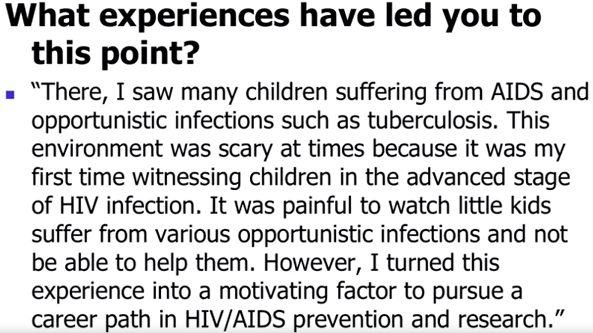

[Coursera - Writing in the Sciences](Coursera%20-%20Writing%20in%20the%20Sciences.md)

# Week 7 - Beyond the Research Manuscript

+ Understand how to write review articles.
+ Become familiar with the grant-writing process.
+ Understand how to write a strong letter of recommendation.
+ Understand how to write a strong personal essay.

## Review article

Goals:
- Synthesize and evaluate the recent primary literature on a topic
- Summarize the current state of knowledge on a topic
- Address controversies
- Provide a comprehensive list of citations

3 types:
- Non-systematic review
	- or called "narrative" review
	- may be not comprehensive
	- qualitative review
- Systematic reviews
	- attempts to find and summarize all relevant studies. May even include unpublished work
	- follows a rigorous search strategy using pre-defined exclusion and inclusion criteria. Searches multiple databases
	- evaluates the quality of each study using rigorous, pre-defined criteria (often quantitative)
- Meta-analysis
	- a systematic review that additionally uses statistical techniques to pool data from independent studies (sometimes including unpublished studies)

Tips for review articles
- start with a more board search, and then narrow it
- clearly define your thesis or theme
- invest time getting organized
- divide the review into sections with separate headings
- consider putting information in tables, figures, and/or sidebars
- write for a broad audience

Outline
- Abstract
- Introduction
	- clearly state the aim of the review
- the body
	- divide into section
	- summarize the literature, organized based on methodology or theme
	- analyze, interpret, critique, and synthesize studies
- conclusion and future direction
	- what recommendations can you make?
	- what gaps remain in the literature?
	- what future studies would help fill in these gaps?
- Literature review

## Grant

Why submit a research proposal?
- Clarifies and deepens your thinking
- increases productivity and impact
- critical in all career paths
- securing funding is an accomplishment and has positive career benefits

Example: https://researchtraining.nih.gov/programs/fellowships

1. Start early and gather critical information
	- compile possible funding opportunities
		- gather critical information
			- instructions
			- funded and unfunded examples
	- Read the funding announcement
	- Identify the review criteria
		- applicant
		- mentor, co-mentor, collaborators
		- research training plan
		- training potential
		- institutional environment and commitment
	- Understand the review process
	- Learn about internal policies and processes
2. Create a Game Plan and Write Regularly
	- Create a task list
	- Write regularly
3. Find Your Research Niche
	- Deep awareness of your field – identify critical knowledge gaps
	- Broad familiarity with the wider scientific community
	- Relevant and appropriate for the mission of the Funding Opportunity Announcement
4. **Use Your Specific Aims Document as Your Roadmap**
	- Why the specific aims document important?
		- perfect for eliciting feedback
		- it is a roadmap
		- reviewers will read it
		- Example: "State concisely the *goals* of the proposed research and summarize the *expected outcome(s)*, including the *impact* that the results of the proposed research will exert on the research field(s) involved. List succinctly the *specific objectives* of the research proposed, e.g., to test a stated hypothesis, create a novel design, solve a specific problem, challenging an existing paradigm or clinical practice, address a critical barrier to progress in the field, or develop new technology". 
	- 4 keys questions:
		- Is the question important?
			- Attention grabbing first sentence
			- Bring reviewers up to speed
			- Frame the knowledge gap/need
		- what is the overall goal?
			- Big-picture goal
			- objective of this proposal
			- best bet / hypothesis
			- supportive preliminary data
		- what specifically will be done?
			- aims
			- working hypotheses
			- methods
		- what is the expected payoff?
			- return on investment
			- related to goals of the funding announcement
		- 
		- 
5. Build a First‐Rate Team of Mentors
	- Leverage the strengths and expertise of collaborators (Team Science)
	- Cross‐disciplinary to accelerate scientific innovation and translation
6. Develop a Complete Career Development Training Plan
	- See video Communicating Your Research Strategy 
	1. Is there a need? 
	2. How will the specific aims be accomplished?
	3. How long will the project take?
	4. What is next?
7. STOP! Get Feedback! 
8. Tell a Consistent and Cohesive Story
	- Grants have numerous documents or sections
	- Must tell a consistent and cohesive story
9. Follow Specific Requirements and Proofread for Errors and Readability 
	- Strictly follow specific formats and page requirements
	- Proofread! 
10. Recycle and Resubmit
	- Recycle: submit to many funding opportunities
	- Resubmit: Try again!

## Research plan

The Research Plan will “bridge” the gap between the need and the payoff

Key Questions for your Research Plan:
1. Is there a need? 
2. How will the project be accomplished?
	1. What methods and analyses will be used?
	2. What are the expected outcomes?
	3. What might go wrong and how will it be managed?
	4. What are the alternative approaches?
3. How long will the project take?

An Outline for your Research Plan
1. **Background/Significance**
	1. Importance of the problem
	2. Premise for the proposed project, including strengths/ weaknesses of published research or preliminary data
	3. Outline the knowledge gap or technical deficiency that the project will overcome 

Note concerning innovation. Innovation in 
- approaches
- methodology 
Describe how your proposal improves upon previous research or technology. 

2. **Aims**
	1. A hypothesis
	2. Specific aims and objectives used to examine the hypothesis
	3. Description of methods/ approaches/ techniques to be used
	4. Discussion of possible problems and how they will be managed
	5. Alternative approaches that might be tried

- Organizing each Aim
	- Introduction
		- Provide an overview of the aim, including: 
			- specific objective
			- working hypothesis
			- rationale
			- expected outcomes
	- Preliminary Data
		- Critical review of the relevant literature
		- Preliminary studies
			- establish feasibility of project
			- clear and able to stand alone 
		- Lead reviewer to conclude that you and the project are capable of success 
	- Methods
		- Provide a detailed description of the experimental design including:
			- validation of essential reagents/approaches
			- description of controls and their significance
			- statistical analysis and interpretation
		- Tips:
			- Using strong words "expect/can", avoid weak words "hope/try"
	- Expected Outcomes
		- Summarize expected experimental outcomes and provide an interpretation of the data. 
		- What is the immediate payoff? Does this address the knowledge gap you wish to bridge? 
	- Alternative Approaches
		- Introduce Alternative Approaches by highlighting potential problems

3. **Timeline**
- Demonstrates feasibility 

4. **Conclusion and Future Directions**
	- Summarize expected outcomes, how they will bridge a current knowledge gap, and how the proposed project will lead to progress in the field
	- Discuss future experiments or approaches

## Recommendation letter

Think to consider:
- it's ok to decline if you cannot write  strong letter
- take into account the competitiveness of the position or award
- never ask students to draft their own letters

The candidate should provide:
- CV or resume
- information about the position or award
- the deadline
- specific information about how to submit the letter

Formatting
- Format it like an old-fashioned letter (date, address of the committee, etc.)
- Use letterhead (or the election version of that)
- Avoid generic greetings such as "to whom it may concern." Rather, address it to a person (if known) or "XX admission committee" or "XX scholarship committee."

Introduction (first paragraph)
- "I am pleased/delighted/thrilled to recommend XX for YY". "It's a pleasure to recommend XX for YY"
- How do you know the candidate? How long have you known the candidate?
- 1-2 sentence overview
	- "She is one of the most brilliant and accomplished students that I have taught to date" (highest praise)
	- "I've found her to be a diligent student and researcher. I'm confident that she would be an asset to your research team." (typical praise)

Body of the letter
- use clear, concise, engaging language!
- the length of the letter matters!
- Address qualities relevant to the position/award, such as:
	- Quantitative skills
	- Communication skills
	- Ability to work with others
	- Initiative
	- Ability to prioritized tasks
	- Creativity
	- Attributes of a good citizen
- Give specific examples and stories "show, don't tell"
	- "I sent her requests for edits at 10 am in the morning, and she turned around the revision by 3 pm the same day."
- Quantify and compare
	- "She is among the top ten percent of MS I have taught at XX"
- Point out extenuating circumstances (if applicable)
- Bold/underline to add emphasis
- If possible, quote others
- Be cautious...
	- When a letter focuses more on the recommender, class, or project than on the candidate, this is a red frag
	- It is OK to highlight strengths from the student's CV, but don't simply repeat what's on the CV.

Concluding paragraph
- In summary...
	- "In sum, XX is a star in all aspects. If there's anything else I can do to support her application, please dont hesitate to contact me" (highest praise)
	- "I highly recomend XX for this position. If you have any further questions, I would be happy to expand further on my comments" (typical praise)

Language
- "Though not the top student in the class, he held his own among an extremely gifted and experienced group" vs
- "he was one of the best students in my class of 50" vs
- "he was the best student in my class of 50" vs
- "he is one of the best students I've had in my career at XX"

- "I have confidence in her ability" vs
- "I have no doubt that she will go on to do first-rate research"

- "She is the most enthusiastic student I've ever worked with." vs
- "She is one of the most talented students I've ever worked with."

Tips for recommendatees
- Approach potential letter writers at least several weeks in advance of the deadline
- choose your recommenders carefully
- take "no" for an answer
- avoid recommenders who ask you to draft your own letter
- make life easy for your letter writer
	- provide them with your CV
	- offer to meet with them
	- give them clear and easy instructions on how to submit the letter
	- provide a link to information about the position or award

## Personal statements

## Tips for personal statements
- make it personal
	- speak from the heart
	- reveal who you are
	-  strive for flair, not "blah"
- give specific examples and stores
	- "show, don't tell"
- don't read your CV line by line
	- highlight relevant experiences
- avoid big words you don't understand and avoid cliches
- show interest in/flatter your readers
	- do your homework
	- be specific about why the specific program/institution/awards appeals to you
- explain gaps and failures
	- don't ignore these in hopes that reviewers won't notice the issue!

### Elements: Opening/lead
- start strong!
- be creative
- be descriptive or tell a story
- impact who you are and what matters to you
- don't be boring
- It's ok if it's a little long if it's compelling!
- 

##  Elements: Body for the essay
- Where do want to go?
- What experiences have led you to this point?
- What makes you a strong candidate?
	- Address weaknesses, and turn them into strengths
- Why this specific program/institution/fellowship?

# References
- Yuan K., Cai L., Ngo SP., Ma L., Botham CM. Ten Simple Rules for Writing a Postdoctoral Fellowship. PLoS Computational Biology. 2016 Jul 14; 12(7):e1004934
- Hollenbach, Andrew. A Practical Guide to Writing a Ruth L. Kirschstein NRSA Grant. Amsterdam: Academic Press, 2014. (ISBN 978‐0‐12‐420187‐3)
- Russell, Stephen W. and David C. Morrison. The Grant Application Writer’s Workbook: National Institutes of Health Version. Los Olivos, CA: Grant Writers’ Seminars and Workshops, LLC, 2016. <www.grantcentral.com> 
- Yang, Otto O. Guide to Effective Grant Writing: How to Write an Effective NIH Grant Application. New York: Springer US, 2012. (eBook ISBN 978‐1‐4614‐1581‐7)
- Sample NIH applications and summary statements are available here: https://www.niaid.nih.gov/grants-contracts/sample-applications

